# Flow Dictation

Flow Dictation is a local-first macOS menu-bar dictation app. Place the cursor in any supported text field, hold **Fn**, speak, and release. Flow records only while the key is held, transcribes the audio, optionally cleans the wording, and inserts the result at the cursor.

It is designed as a small, private alternative to cloud-only dictation tools: there are no accounts, analytics, or telemetry. With local transcription and cleanup disabled, audio and text never leave the Mac.

## Product flow

1. Flow runs quietly as **Flow** in the macOS menu bar.
2. Hold the configured hotkey, by default **Fn**.
3. The dark floating pill says **Recording** while the microphone is live.
4. Release the key. The pill changes to **Transcribing**.
5. Flow turns the captured audio into text using the configured provider.
6. Flow applies fast local formatting. It can normalize spoken punctuation, common numbers/currency/percentages, dates, acronyms, spoken lists, and real pauses.
7. When an optional LLM is configured, Flow can also resolve nuanced retractions, fillers, Hinglish grammar, and list wording.
8. The final text is inserted into the original app with a standard Command-V. Flow restores the clipboard shortly afterward.

`Copy Last Transcript` in the Flow menu is available after a successful dictation. It is useful for recovery when an app rejects programmatic insertion.

## Architecture

```mermaid
flowchart LR
    Key[Fn or configured shortcut] --> Hotkey[HotkeyMonitor]
    Hotkey -->|press| Audio[AudioRecorder]
    Audio -->|16 kHz mono WAV| Temp[Temporary audio file]
    Hotkey -->|release| Pill[Recording pill: Transcribing]
    Temp --> Engine{Transcription mode}
    Engine -->|local| Whisper[whisper.cpp CLI]
    Engine -->|OpenAI or Groq| WhisperAPI[Whisper API]
    Whisper --> Transcript[Raw transcript]
    WhisperAPI --> Transcript
    Transcript --> LocalCleanup[Local deterministic cleanup]
    LocalCleanup --> Cleanup{LLM cleanup needed and configured?}
    Cleanup -->|yes| LLM[OpenAI or Groq chat model]
    Cleanup -->|no| Final[Final transcript]
    LLM --> Final
    Final --> Guard[Output drift guard]
    Guard --> Paste[Restore original app focus and Cmd-V]
    Paste --> Editor[Previously focused macOS app]
```



### Runtime components

| Component | Responsibility |
| --- | --- |
| `AppDelegate` | Owns the menu bar, settings, permissions, hotkey lifecycle, and the dictation state machine. |
| `HotkeyMonitor` | Watches Fn through both a Core Graphics event tap and AppKit global monitor; release ends dictation. Includes a release watchdog to avoid a stuck recording. |
| `AudioRecorder` | Captures microphone input with `AVAudioEngine`, converts it to 16 kHz mono PCM, and writes a temporary WAV file. |
| `RecordingPill` | Shows the dark, non-activating recording/transcribing indicator across Spaces and full-screen apps. |
| `TranscriptionService` | Runs local `whisper-cli` or sends the WAV to OpenAI/Groq. It collapses exact repeated utterances and can read Whisper VTT timings for pause-aware paragraphs. |
| `DictationCleanup` | Applies local deterministic formatting, offline spoken-list conversion, simple retraction handling, and output-drift protection. |
| `TranscriptRefiner` | Optionally sends only transcript text to a configured LLM for nuanced cleanup. It skips simple clips and discards unsafe rewrites. |
| `PasteInjector` | Restores the original target app, waits for it to become active, and posts standard Command-V. |
| `SettingsStore` | Reads and writes `~/.flow-dictation/config.json`; `.env` is read only for API keys. |

## Install from GitHub

The GitHub repository is the source of truth; [GitHub Releases](../../releases) is the normal installation path. A release contains a `FlowDictation-<version>-<architecture>.dmg` and its `.sha256` checksum.

1. Download the DMG matching the Mac architecture: `arm64` for Apple Silicon or `x86_64` for Intel.
2. Open it and drag **Flow Dictation.app** to **Applications**.
3. Launch Flow Dictation from Applications. Do not use `open -n`; it starts a second process and can duplicate hotkey handling.
4. Open the **Flow** menu bar item and select **Download Small English Model (488 MB)**. The app verifies the downloaded file before installing it in `~/Library/Application Support/FlowDictation/Models/`.
5. Grant the three permissions below.

The DMG includes the `whisper.cpp` runtime and its Apple Silicon backend plug-ins. Users do **not** need Homebrew, Python, a terminal, an account, or an API key for the local speech-to-text path.

### Grant macOS permissions

Grant all three permissions to **FlowDictation** under **System Settings > Privacy & Security**:

| Permission | Why Flow needs it |
| --- | --- |
| **Microphone** | Records audio only during a held dictation. |
| **Input Monitoring** | Lets the global Fn hotkey work while another app is active. |
| **Accessibility** | Lets Flow activate the original app and insert text at the cursor. |

After changing a permission, quit and relaunch Flow. The Flow menu reports the live state:

- `Global hotkey: active (hold Fn)` means the hotkey listener started.
- `Text insertion: ready` means macOS Accessibility access is available.

If macOS shows a permission toggle as enabled but Flow still reports it unavailable, reset just the stale record and enable it again:

```zsh
tccutil reset Accessibility local.flowdictation
```

Then return to **Accessibility**, enable `FlowDictation`, and relaunch Flow. This reset does not affect the microphone or Input Monitoring permissions.

## Build from source

Homebrew is a **build dependency only**. It is not required by people installing the published DMG.

```zsh
brew install whisper-cpp libomp
git clone https://github.com/SK-AIPM404/flow-dictation.git
cd flow-dictation
./scripts/build-app.sh
open "$(pwd)/dist/FlowDictation.app"
```

`build-app.sh` signs with the local identity `Flow Dictation Local Signing v2` if it exists in the keychain. That identity is specific to the original development Mac, so on any other machine use an ad-hoc signature instead:

```zsh
FLOW_DICTATION_SIGNING_IDENTITY=- ./scripts/build-app.sh
```

## Build a DMG

```zsh
cd /path/to/flow-dictation
./scripts/build-dmg.sh
```

The script creates a Finder-friendly disk image plus checksum under `dist/`:

```text
dist/FlowDictation-0.2.0-arm64.dmg
dist/FlowDictation-0.2.0-arm64.dmg.sha256
```

DMGs are architecture-specific because they bundle the local Whisper runtime. Build releases on Apple Silicon for `arm64`; build separately on an Intel Mac for `x86_64`. A universal release is a future packaging task.

## Sign and publish a public release

For people outside the development team, use an Apple **Developer ID Application** certificate and notarize the finished DMG. Apple recommends Developer ID signing and notarization for direct macOS distribution so Gatekeeper can verify that the app is genuine and unmodified. [Apple distribution guide](https://developer.apple.com/macos/distribution/) and [notarization guide](https://developer.apple.com/documentation/security/notarizing-macos-software-before-distribution)

```zsh
export FLOW_DICTATION_SIGNING_IDENTITY="Developer ID Application: Your Name (TEAMID)"
./scripts/build-dmg.sh
./scripts/notarize-dmg.sh "$(pwd)/dist/FlowDictation-0.2.0-arm64.dmg"
gh release create v0.2.0 \
  "dist/FlowDictation-0.2.0-arm64.dmg" \
  "dist/FlowDictation-0.2.0-arm64.dmg.sha256" \
  --generate-notes
```

Before running the notarization script, store App Store Connect credentials once using `xcrun notarytool store-credentials` with the keychain profile name `FlowDictationNotary`, or set `FLOW_DICTATION_NOTARY_PROFILE` to another existing profile.

The repository includes a GitHub Actions workflow that builds an **unsigned test artifact** on tags and manual runs. Do not publish that artifact directly; publish only a Developer-ID-signed and notarized DMG.

## Configuration

Flow creates its settings file on first launch:

```text
~/.flow-dictation/config.json
```

Use **Open Settings File** and **Reload Settings** from the Flow menu after making changes. To use a different file, set `FLOW_DICTATION_CONFIG` before launching the app.

```json
{
  "enabled": true,
  "hotkey": {
    "kind": "fn",
    "keyCode": 49,
    "modifiers": ["command", "shift"]
  },
  "transcription": {
    "mode": "local",
    "openAIModel": "whisper-1",
    "groqModel": "whisper-large-v3-turbo"
  },
  "localWhisper": {
  "whisperBinary": "bundled",
  "modelPath": "~/Library/Application Support/FlowDictation/Models/ggml-small.en.bin",
    "extraArgs": []
  },
  "llm": {
    "enabled": true,
    "provider": "auto",
    "openAIModel": "gpt-4o-mini",
    "groqModel": "llama-3.1-8b-instant"
  },
  "cleanup": {
    "verbatimMode": false,
    "removeFillers": true,
    "resolveRetractions": true,
    "improveHinglish": true,
    "formatLists": true,
    "deterministicFormatting": true,
    "paragraphBreaksFromPauses": true,
    "skipLLMForSimpleClips": true,
    "maximumEditDistanceRatio": 0.72,
    "minimumOutputWordRatio": 0.45,
    "maximumOutputWordRatio": 1.55
  },
  "pasteRestoreDelayMilliseconds": 350
}
```

| Setting | Values | Meaning |
| --- | --- | --- |
| `enabled` | `true`, `false` | Enables or disables dictation without quitting the app. |
| `hotkey.kind` | `fn`, `shortcut` | Uses Fn or a configurable hold shortcut. |
| `hotkey.keyCode` | macOS virtual key code | Key used when `kind` is `shortcut`; Space is `49`. |
| `hotkey.modifiers` | `command`, `shift`, `option`, `control`, `fn` | Required modifiers for a shortcut. |
| `transcription.mode` | `local`, `openai`, `groq`, `auto` | Selects the audio transcription backend. |
| `localWhisper` | CLI path, model path, arguments | Configures offline whisper.cpp use. |
| `llm.enabled` | `true`, `false` | Enables optional transcript cleanup. |
| `llm.provider` | `none`, `openai`, `groq`, `auto` | Selects the cleanup model provider. |
| `cleanup.verbatimMode` | `true`, `false` | Bypasses all cleanup and preserves the raw transcript. |
| `cleanup.*` feature toggles | `true`, `false` | Individually controls fillers, retractions, Hinglish grammar, list formatting, deterministic formatting, pauses, and fast-path behavior. |
| `cleanup.maximumEditDistanceRatio` | decimal | Rejects an LLM rewrite that differs too much from the deterministic baseline. |
| `pasteRestoreDelayMilliseconds` | milliseconds | Time to keep the result on the clipboard before restoring the prior clipboard. |

### Hotkey alternatives

Fn is the default hold-to-talk key. Some external keyboards, keyboard-management software, and macOS Fn/Globe settings can intercept it. A hold shortcut is the fallback:

```json
"hotkey": {
  "kind": "shortcut",
  "keyCode": 49,
  "modifiers": ["command", "shift"]
}
```

This example means hold Command-Shift-Space to record and release to transcribe.

## Transcription modes

| Mode | Audio destination | Requirements |
| --- | --- | --- |
| `local` | Stays on the Mac | `whisper-cli` plus a downloaded model. |
| `openai` | OpenAI transcription API | `OPENAI_API_KEY` in `.env`. |
| `groq` | Groq transcription API | `GROQ_API_KEY` in `.env`. |
| `auto` | OpenAI first, then Groq, otherwise local | One of those keys or a local Whisper setup. |

For cloud modes, put keys in either `~/.flow-dictation/.env` or the directory from which Flow is launched:

```zsh
mkdir -p ~/.flow-dictation
cp .env.example ~/.flow-dictation/.env
```

```dotenv
OPENAI_API_KEY=
GROQ_API_KEY=
```

The `.env` file is ignored by Git and is never included in the app bundle.

## Models, quality, and latency

### What runs locally today

By default, Flow uses **whisper.cpp** with the local `ggml-small.en.bin` Whisper speech-to-text model. Whisper is an audio transcription model, not an LLM. It runs on the Mac with no subscription, account, network request, or API key.

Flow does **not** use OpenAI or Groq by default. They are used only when you explicitly select `openai`, `groq`, or `auto` and add the corresponding API key to `.env`.

| Capability | Local by default | Needs OpenAI or Groq key |
| --- | --- | --- |
| Speech-to-text | Yes: whisper.cpp small English model | Optional alternative via Whisper API |
| Spoken punctuation, common numbers, currency, percentages, dates, and acronyms | Yes | No |
| Simple spoken lists such as `first`, `second`, `third` | Yes | No |
| Paragraph breaks from Whisper pauses | Yes | No |
| Nuanced filler removal and false-start judgment | Limited heuristic support | Yes, for best results |
| Complex retractions and Hinglish-to-English grammar | Limited heuristic support | Yes, for best results |

### Improve local accuracy

`small.en` is the current speed/quality default. Use `medium.en` for better English accuracy, especially on names, fast speech, and longer dictations. It uses more memory and increases transcription time.

```zsh
curl -fL -o ~/Models/ggml-medium.en.bin \
  https://huggingface.co/ggerganov/whisper.cpp/resolve/main/ggml-medium.en.bin
```

Then set:

```json
"localWhisper": {
  "whisperBinary": "/opt/homebrew/bin/whisper-cli",
  "modelPath": "~/Models/ggml-medium.en.bin",
  "extraArgs": []
}
```

### Improve latency

Flow automatically uses up to eight CPU threads unless `localWhisper.extraArgs` contains `-t` or `--threads`. On the current 10-core M5, that means eight threads by default.

```json
"localWhisper": {
  "extraArgs": ["-t", "8"]
}
```

This setting is optional; it only overrides the automatic choice. The current app invokes `whisper-cli` per dictation, so loading the model is part of every request. The next architectural latency upgrade is a long-lived local Whisper service that keeps the model in memory between dictations.

## Cleanup and privacy

Flow uses a two-stage cleanup pipeline:

1. **Deterministic local formatting:** spoken punctuation, simple spoken numbers, currency, percentages, dates, common letter-spoken acronyms such as KPI and API, spoken lists, pause-derived paragraphs, and straightforward corrections. This is instant and stays on the Mac.
2. **Bounded LLM cleanup, when configured:** handles filler-versus-meaning judgment, complex retractions, Hinglish grammar, and list wording. The prompt can only clean dictated text; it must never answer or add content.

The cleanup guard rejects an empty, unusually short/long, or high-edit-distance LLM result and falls back to the raw transcript. Simple clips with no filler, correction, Hinglish, or list signals skip the LLM entirely.

Whisper's VTT segment timings create paragraph breaks only when it reports a pause of about 1.2 seconds or longer.

- With `llm.enabled: true` and a configured API key, Flow sends the **transcript text only** to the selected LLM provider.
- With no key available, deterministic formatting still runs locally; semantic cleanup is skipped.
- With `llm.enabled: false` and `llm.provider: "none"`, cleanup uses deterministic local formatting only. Turn on `verbatimMode` to preserve the raw transcript exactly.

For completely offline dictation:

```json
"transcription": { "mode": "local" },
"llm": { "enabled": false, "provider": "none" }
```

In this configuration, the only temporary artifact is a WAV file under the macOS temporary directory. Flow removes it after transcription. No audio, transcript, analytics, or account information is sent off the Mac.

## Menu bar controls

| Control | Action |
| --- | --- |
| `Dictation Enabled` | Turns dictation on or off. |
| `Launch at Login` | Registers Flow with macOS login items. |
| `Copy Last Transcript` | Copies the latest successful transcript for manual recovery. |
| `Paste Raw Last Transcript` | One-click reversion: inserts the unmodified transcription into the last target app. |
| `Cleanup` | Verbatim mode and independent feature toggles for every cleanup behavior. |
| `Open Settings File` | Opens `~/.flow-dictation/config.json`. |
| `Reload Settings` | Reloads the JSON configuration and restarts hotkey monitoring. |
| `Quit Flow Dictation` | Stops recording and exits the menu-bar app. |

## Troubleshooting

### The Fn pill only appears after opening Flow

Confirm Input Monitoring is enabled for the current `FlowDictation` app, then fully quit and reopen Flow. Fn events are hardware- and keyboard-layout-dependent; use the shortcut fallback above if a keyboard driver intercepts Fn.

### The pill appears, but no text is inserted

1. Verify the Flow menu says `Text insertion: ready`.
2. Test the destination in a normal text field, not a password field or secure input.
3. Check `Copy Last Transcript`. If it has text, recording and transcription succeeded; the destination app rejected automated insertion.
4. Increase `pasteRestoreDelayMilliseconds` if the target app accepts paste slowly.

Password managers, secure text fields, and apps that deliberately block synthetic input can refuse insertion by design. Browser chat composers should have their text cursor active before dictation begins.

### The pill says Transcribing, then Flow reports no text

Check **Microphone** permission and the selected input device in macOS Sound settings. For local mode, also confirm:

```zsh
/opt/homebrew/bin/whisper-cli -m ~/Models/ggml-small.en.bin --help
```

### The app does not open

Build it first, then launch the bundle with an absolute path:

```zsh
cd /path/to/flow-dictation
./scripts/build-app.sh
open "$(pwd)/dist/FlowDictation.app"
```

## Repository layout

```text
Sources/FlowDictation/
  AppDelegate.swift          Application state, menu bar, orchestration
  AudioRecorder.swift        Microphone capture and WAV normalization
  HotkeyMonitor.swift        Global hold-to-talk monitoring
  PasteInjector.swift        Focused-field insertion and paste fallback
  RecordingPill.swift        Floating recording status UI
  Settings.swift             JSON and .env loading
  TranscriptRefiner.swift    Optional LLM cleanup
  Transcription.swift        Local and cloud Whisper backends
Resources/Info.plist         macOS app metadata and microphone usage text
scripts/build-app.sh         Release build, bundle, and signing script
config.example.json          Example settings
```

## Development

```zsh
swift build
swift run
```

`swift run` is convenient while changing code, but its process identity differs from the packaged app. Use the signed `dist/FlowDictation.app` for normal permissions and daily use.
